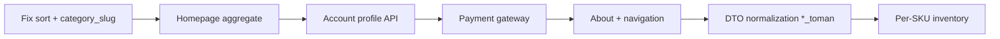

# Backend Improvements

Architectural and API design recommendations from the 2026-06-30 audit.

---

## API Design

### 1. Versioned store DTOs separate from admin DTOs

Customer-facing responses should use a dedicated `dto/response/store_*.go` package with:

- Integer `*_toman` amounts (no floats in JSON)
- Customer-safe field sets (no internal IDs like `coupon_id` on order detail)
- Persian-ready `message` fields on validation errors

Admin DTOs can retain richer internal fields. Sharing `OrderDetailResponse` between admin and store causes contract leakage.

### 2. Aggregated read endpoints for page-level data

The homepage, about page, and product detail benefit from **Backend-for-Frontend (BFF)** aggregates:

| Page | Current calls | Target |
|------|---------------|--------|
| `/` | homepage + categories + theme | Single `GET /store/homepage` |
| `/about` | settings (partial) | `GET /store/about` |
| `/products/:id` | product + reviews summary + wishlist state | Optional `?include=reviews_summary,wishlist` |

Reduces waterfall requests on slow mobile networks (primary Store OS audience).

### 3. Slug-first public resource paths

Product detail accepts slug; reviews, Q&A, and wishlist use UUID. **Standardize slug resolution** in a shared middleware or helper:

```go
func ResolveProductID(ctx, slugOrID string) (uuid.UUID, error)
```

Apply to all `/store/products/{ref}/...` sub-routes.

### 4. OpenAPI as contract gate

Swagger documents `sort=bestseller|newest|discounted` but repository ignores them. Add CI check:

```bash
go test ./internal/... # integration tests per documented query param
```

Or generate contract tests from `swagger.yaml`.

---

## REST Conventions

### Consistent path naming

| Issue | Current | Recommended |
|-------|---------|-------------|
| Blog list | `/store/blog/posts` | Keep; document alias `/store/blog` |
| Admin reviews | `/admin/reviews` | Docs say `/admin/product-reviews` — pick one |
| FAQ | Split `/faq` + `/faq/items` | OK for REST; document atomic save pattern for UI |

### HTTP verbs and status codes

| Pattern | Recommendation |
|---------|----------------|
| Wishlist duplicate add | `200` idempotent preferred over `409` for UX |
| Contact status update | Return `200` + body instead of `204` for SPA state updates |
| Stock conflict on checkout | `409` with structured `unavailable_items[]` |
| Review moderation | `PATCH /status` is fine; document enum values |

### Pagination envelope

All list endpoints should return:

```json
{ "data": [], "meta": { "page", "per_page", "total", "total_pages" } }
```

Blog categories and theme list currently return bare arrays.

---

## Naming

### Field naming standard (store API)

| Concept | Standard name |
|---------|---------------|
| Money | `*_toman` (int64) |
| Timestamps | `created_at`, `updated_at`, `added_at` (wishlist) |
| Images | `thumbnail_url`, `cover_image_url` |
| Text summary | `excerpt` (add alias from `summary`) |
| Booleans | `is_on_sale`, `is_out_of_stock`, `is_verified_buyer` |

Provide **deprecated aliases** during migration (`summary` + `excerpt` both present for one release).

---

## Status Codes & Error Handling

### Structured validation errors

Frontend forms (checkout, contact, profile) need field-level errors:

```json
{
  "statusCode": 400,
  "path": "/api/v1/store/checkout",
  "error": {
    "code": "VALIDATION_ERROR",
    "message": "...",
    "details": { "shipping_address.postal_code": "invalid format" }
  }
}
```

Already supported via `apperror.Validation` — ensure all storefront handlers use it consistently.

### Persian user messages

Store-facing errors should return Persian `message` strings for coupon, stock, and contact validation. Keep English `code` for logging.

---

## Response Consistency

### Single product card mapper

One function `ToStoreProductCard(product, opts)` used by:

- Catalog list
- Homepage slides
- Wishlist nested product
- Related products

Eliminates `price` vs `price_toman` drift.

### Order amounts

Store order DTOs should never expose `float64` currency. Use integer Toman throughout the Persian storefront.

---

## Pagination, Filtering, Sorting

### Catalog

Implement documented filters in `StoreListFilter`:

```go
type StoreListFilter struct {
    Query           string
    CategoryID      *uuid.UUID
    CategorySlug    string
    IncludeChildren bool
    Brand           string
    Sort            string  // mapped: bestseller, newest, discounted, price_asc, price_desc
    OnSale          *bool
    InStock         *bool
}
```

### Admin lists

Add pagination to: themes, partner brands, homepage reviews, FAQ items (when list grows).

### Orders (admin)

`from`/`to` date filter is implemented — update stale documentation.

---

## Performance

### Caching (already started)

Redis cache on `GET /store/products` and `GET /store/homepage` (5 min TTL). Extend to:

- `GET /store/categories` (invalidate on category CRUD)
- `GET /store/navigation` (when added)
- `GET /store/theme` (invalidate on style update)

Use cache tags or key prefixes for targeted invalidation on admin content updates.

### Homepage stats

Precompute `customers_count`, `delivered_orders_count` in a materialized view or Redis counter updated on order/customer events — avoid heavy COUNT on every homepage load.

### N+1 on product slides

`BuildHomepage` should batch-load products for all slide items in one query.

---

## Security

### Public endpoints

- Rate-limit `POST /store/contact` (auth routes already limited)
- Honeypot field `website` on contact forms
- CAPTCHA on contact/checkout for production

### Customer data isolation

Order detail and wishlist must verify `customer_id` matches JWT subject — audit all store account handlers.

### Upload hardening

- Validate MIME type from content, not just extension
- Max file size per context (image 10MB, video 50MB)
- S3 presigned URLs for large video uploads (future)

### Audit log

Admin audit middleware is wired — ensure sensitive reads (customer PII export) are logged if added.

---

## Transactions

### Checkout atomicity

`PlaceCheckout` must wrap in a single DB transaction:

1. Validate stock
2. Decrement inventory
3. Create order + items
4. Increment coupon usage
5. Create guest customer if needed

Verify rollback on any failure (partially implemented — add integration test).

### Theme purchase

`PurchaseTheme` should be idempotent if user already owns theme.

---

## Database

### Per-SKU inventory (future)

Current schema has `skus` table but inventory is product-level. For building materials with size/color variants, migrate to `sku_inventory` or stock on `skus` row.

### About content

Options:

1. JSONB column on `store_settings` (`about_page`)
2. Dedicated `about_sections` table

Prefer JSONB for v1 speed; normalize if CMS grows.

### Indexes for catalog sort

Add index supporting bestseller query:

```sql
CREATE INDEX idx_order_items_product_created ON order_items(product_id, created_at);
```

---

## Scalability

### Stateless API

Current design is stateless — good for horizontal scaling. Redis cache and rate limiter must use shared Redis in multi-instance deploys.

### Background jobs

Move to async:

- Order confirmation email
- Contact message admin notification
- Blog comment moderation queue

Use a simple job table or Redis queue before introducing full worker service.

### Payment webhooks

Payment callback should be idempotent and fast — verify signature, update order, enqueue email, return 200 immediately.

---

## Maintainability

### Documentation sync

These files are **stale** and contradict `router.go`:

- `docs/architecture/gap-analysis.md`
- `docs/api/admin-api.md`
- `docs/README.md` executive summary (partially)

Point all docs to `docs/api-audit/` after this audit. Regenerate `admin-api.md` from Swagger.

### Feature flags

Use config for:

- `AUTH_SIGNUP_ENABLED`
- COD payment enabled
- Guest checkout enabled
- Review auto-publish vs moderation

### Test coverage gaps

Add contract tests for:

- Catalog sort params (each documented value)
- Homepage projection completeness
- Checkout preview → place order happy path
- Customer order isolation (403 on other user's order)

---

## Recommended implementation order



1. **Week 1:** Catalog sort/filter fixes, homepage extensions, Swagger sync  
2. **Week 2:** Account profile, public navigation, about page  
3. **Week 3:** Payment integration, shipping methods, checkout hardening  
4. **Week 4:** DTO normalization, related products, wishlist polish, doc cleanup
