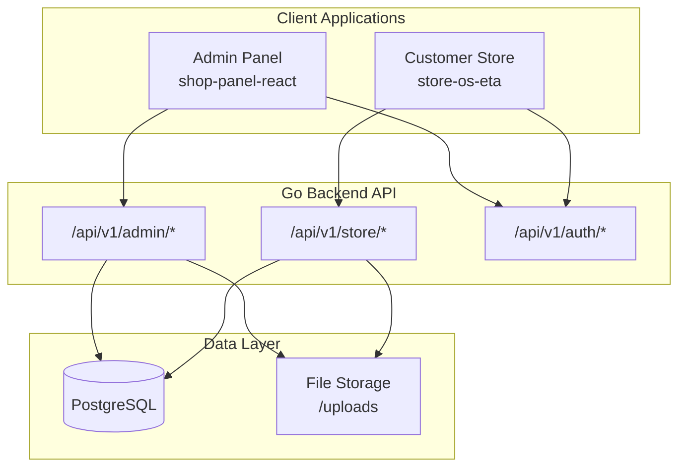

# Architecture Overview

## System Context



## Current vs Target Architecture

### Current (Implemented)

```
internal/
├── domain/           # 12 bounded contexts (user, product, order, ...)
├── application/      # 12 services — admin use cases only
├── infrastructure/   # GORM repos, JWT, SMTP, file upload
└── interfaces/http/  # Admin routes under /api/v1/admin/*
```

**Authorization:** JWT with `admin` | `customer` roles. All admin routes require `admin`.

**Missing:** Entire `/api/v1/store/*` public API surface.

### Target (Recommended)

```
internal/
├── domain/
│   ├── storefront/       # Cart, checkout session (optional)
│   ├── storecontent/     # Hero, slides, banners, FAQ, homepage reviews
│   ├── blog/             # Posts, categories, comments
│   ├── contact/          # Inbound messages
│   └── theme/            # Theme catalog, purchases, style tokens
├── application/
│   ├── storefront/       # Catalog browse, cart, checkout, wishlist
│   ├── storecontent/
│   ├── blog/
│   ├── contact/
│   └── theme/
└── interfaces/http/
    ├── admin/            # Existing admin handlers
    └── store/            # New public + customer-authenticated handlers
```

## Bounded Contexts

| Context | Responsibility | Admin UI | Store UI |
|---------|---------------|----------|----------|
| **Identity** | Auth, users, customers | signin, users | account |
| **Catalog** | Products, categories, brands, attributes, SKUs | products, products/settings | products, product detail |
| **Inventory** | Stock levels, low-stock alerts | dashboard, products | product detail availability |
| **Commerce** | Orders, coupons, checkout | orders, coupons | checkout |
| **Store Config** | Site, contact, social, SEO | general-setting, setting-seo | footer, meta |
| **Store Content** | Homepage sections | context/* | homepage sections |
| **Theme** | Layout themes, color/font tokens | themes, set-style | entire store appearance |
| **Blog** | Posts, categories, comments | weblog/* | /blog |
| **Engagement** | Contact messages, reviews, Q&A | contact | contact forms, product tabs |
| **Analytics** | Dashboard KPIs | dashboard | — |

## API Namespace Design

| Prefix | Auth | Purpose |
|--------|------|---------|
| `/api/v1/auth/*` | Public / Bearer | Login, signup, refresh, password reset |
| `/api/v1/admin/*` | Bearer + `admin` | Back-office operations |
| `/api/v1/store/*` | Public / optional Bearer | Storefront read + customer actions |
| `/api/v1/store/account/*` | Bearer + `customer` | Profile, orders, wishlist |

## Cross-Cutting Concerns

| Concern | Current | Recommendation |
|---------|---------|----------------|
| Validation | `pkg/validator` + handler DTOs | Add domain-level validation for new aggregates |
| Errors | `pkg/apperror` standard envelope | Reuse for store API |
| Pagination | `pkg/pagination` | Reuse for all list endpoints |
| File uploads | `POST /admin/uploads` | Add `POST /store/uploads` for customer avatars (future) |
| Caching | None | Cache storefront content + catalog reads (Redis optional) |
| Events | None implemented | Emit `OrderPlaced`, `StockAdjusted` for async notifications |

## Deployment Topology

```
┌─────────────┐     ┌─────────────┐     ┌─────────────┐
│ Admin Panel │     │  Store OS   │     │  Go API     │
│  (Vercel)   │────▶│  (Vercel)   │────▶│  (Docker)   │
└─────────────┘     └─────────────┘     └──────┬──────┘
                                               │
                                        ┌──────▼──────┐
                                        │ PostgreSQL  │
                                        └─────────────┘
```

Both frontends are static/SSR apps on Vercel calling the same Go API. CORS must allow both origins.
