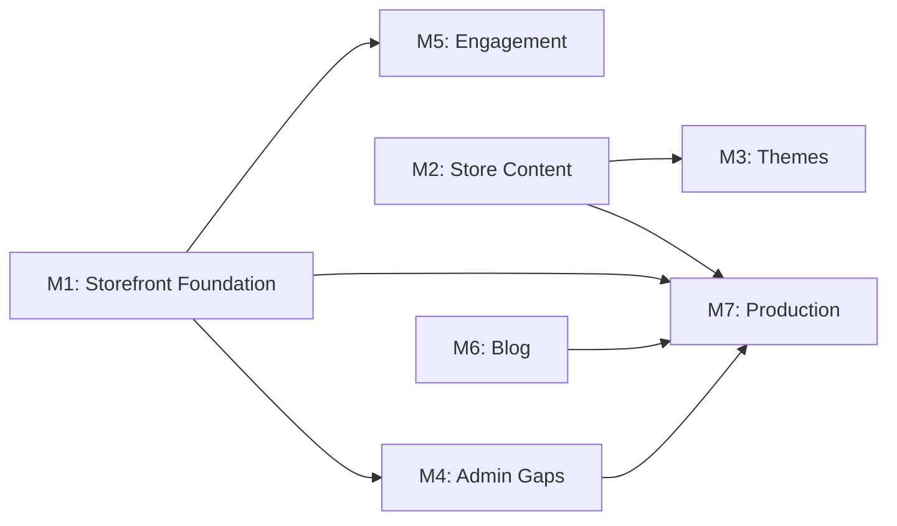

# Development Roadmap

## Milestone 1 — Storefront Foundation (Critical)

**Goal:** Customer store can browse products and complete checkout.

| # | Task | Priority | Complexity | Dependencies |
|---|------|----------|------------|--------------|
| 1.1 | Design and implement `GET /store/products` (list, search, filters) | Critical | Medium | Product repo |
| 1.2 | Design and implement `GET /store/products/{slug\|id}` with variants/SKUs | Critical | High | SKU schema |
| 1.3 | Design and implement `GET /store/categories` (tree) | Critical | Low | Category repo |
| 1.4 | Implement `POST /store/checkout` (validate cart, create order, apply coupon) | Critical | High | Order service, coupon validator |
| 1.5 | Implement `POST /store/coupons/validate` | Critical | Low | Coupon service |
| 1.6 | Customer auth endpoints for store (`signup`, `login` reuse auth) | Critical | Low | Auth service |
| 1.7 | `GET /store/account/orders` for order history | High | Medium | Order repo |
| 1.8 | Extend product DTOs for SKU variant matrix | Critical | Medium | Product service |
| 1.9 | CORS configuration for store Vercel origin | Critical | Low | Config |
| 1.10 | Stock decrement on order placement | Critical | Medium | Inventory service |

**Suggested order:** 1.9 → 1.8 → 1.1 → 1.2 → 1.3 → 1.6 → 1.5 → 1.4 → 1.10 → 1.7

---

## Milestone 2 — Storefront Content (High)

**Goal:** Admin can configure homepage; store renders dynamic content.

| # | Task | Priority | Complexity | Dependencies |
|---|------|----------|------------|--------------|
| 2.1 | `storefront_hero` table + admin CRUD + `GET /store/homepage` | High | Medium | Upload service |
| 2.2 | `product_slides` table (3 carousels) + admin CRUD | High | Medium | Product repo |
| 2.3 | `pro_banners` table + admin CRUD | High | Medium | Upload service |
| 2.4 | `partner_brands` table + admin CRUD | High | Low | Upload service |
| 2.5 | `homepage_reviews` table + admin CRUD | High | Low | Upload service |
| 2.6 | `faq_sections` + `faq_items` tables + admin CRUD | High | Medium | — |
| 2.7 | Contact section image config | Medium | Low | Settings or new table |
| 2.8 | Aggregated `GET /store/homepage` endpoint | High | Medium | 2.1–2.7 |
| 2.9 | Storefront navigation API (separate from admin nav) | High | Low | Settings extension |
| 2.10 | `GET /store/settings` (site, contact, social, SEO) | High | Low | Settings repo |

**Suggested order:** 2.1 → 2.2 → 2.3 → 2.4 → 2.5 → 2.6 → 2.7 → 2.9 → 2.10 → 2.8

---

## Milestone 3 — Theme System (High)

**Goal:** Admin can browse, purchase, and apply themes with custom colors/fonts.

| # | Task | Priority | Complexity | Dependencies |
|---|------|----------|------------|--------------|
| 3.1 | `store_themes` catalog table + seed themes | High | Medium | — |
| 3.2 | `theme_purchases` table + buy endpoint | High | Medium | 3.1 |
| 3.3 | `store_style` singleton (active theme + 12 colors + font) | High | Medium | 3.2 |
| 3.4 | Admin APIs: list themes, purchase, get/set style | High | Medium | 3.1–3.3 |
| 3.5 | `GET /store/theme` public endpoint | High | Low | 3.3 |
| 3.6 | Checkout theme preview routes (static, frontend-only) | Low | Low | — |

**Suggested order:** 3.1 → 3.2 → 3.3 → 3.4 → 3.5

---

## Milestone 4 — Admin Panel Gaps (High)

**Goal:** Close remaining admin UI ↔ backend gaps.

| # | Task | Priority | Complexity | Dependencies |
|---|------|----------|------------|--------------|
| 4.1 | Add `from`/`to` date params to `GET /admin/orders` | High | Low | Order repo |
| 4.2 | Verify invoice endpoint matches UI print layout | Medium | Low | Order handler |
| 4.3 | Verify manual order create matches UI form | Medium | Medium | Order service |
| 4.4 | Wire customer PUT/DELETE in frontend | Medium | Low | Already exists |
| 4.5 | Admin user management UI wiring | Medium | Low | Already exists |

---

## Milestone 5 — Engagement Features (Medium)

**Goal:** Reviews, wishlist, Q&A, contact inbox.

| # | Task | Priority | Complexity | Dependencies |
|---|------|----------|------------|--------------|
| 5.1 | `wishlist_items` table + CRUD APIs | Medium | Low | Customer auth |
| 5.2 | `product_reviews` table + store POST + admin moderation | Medium | Medium | Product, customer |
| 5.3 | `product_questions` table + store POST + admin answer | Medium | Medium | Product |
| 5.4 | `contact_messages` table + store POST + admin inbox | Medium | Medium | — |
| 5.5 | Email notification on new contact message | Low | Low | SMTP |

**Suggested order:** 5.4 → 5.1 → 5.2 → 5.3 → 5.5

---

## Milestone 6 — Blog CMS (Medium)

**Goal:** Admin manages blog; store displays posts.

| # | Task | Priority | Complexity | Dependencies |
|---|------|----------|------------|--------------|
| 6.1 | `blog_posts`, `blog_categories` tables | Medium | Medium | — |
| 6.2 | Admin blog CRUD APIs | Medium | Medium | 6.1 |
| 6.3 | `blog_comments` table + moderation API | Medium | Medium | 6.1 |
| 6.4 | Public `GET /store/blog` and `GET /store/blog/{slug}` | Medium | Low | 6.1 |
| 6.5 | Blog settings (categories management) | Medium | Low | 6.1 |

---

## Milestone 7 — Production Hardening (Low–Medium)

| # | Task | Priority | Complexity | Dependencies |
|---|------|----------|------------|--------------|
| 7.1 | Rate limiting on auth and checkout | Medium | Low | — |
| 7.2 | Audit log write integration | Low | Medium | Existing table |
| 7.3 | Redis cache for homepage + catalog | Medium | Medium | Milestone 2 |
| 7.4 | S3 migration for uploads | Medium | Medium | Upload service |
| 7.5 | Payment gateway integration (Zarinpal/IDPay) | High | High | Milestone 1 |
| 7.6 | Order confirmation email | Medium | Low | SMTP, Milestone 1 |
| 7.7 | Integration tests for checkout flow | Medium | High | Milestone 1 |

---

## Complexity Scale

| Level | Meaning | Typical Duration |
|-------|---------|------------------|
| Low | 1–2 days | Single endpoint or wiring |
| Medium | 3–5 days | New entity + service + handlers |
| High | 1–2 weeks | Multi-entity workflow or external integration |

---

## Dependency Graph

**Parallel tracks:** M1 + M2 can start simultaneously. M3 depends on M2. M5 + M6 can run after M1.
