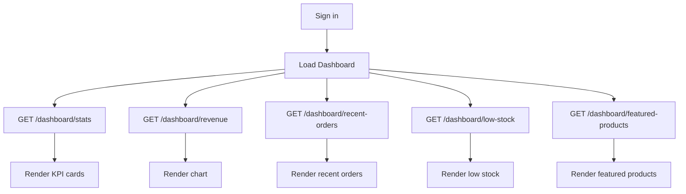

# Admin Dashboard

**Route:** `/`  
**Status:** ✅ Backend implemented  
**Base URL:** `http://localhost:8080/api/v1`

---

## Purpose

The admin dashboard is the landing page after sign-in. It gives store operators an at-a-glance view of business health through six KPI cards, a dual-series revenue chart, a featured-products widget, a recent-orders table, and a low-stock alert list. The page is read-only; all actions link out to Products or Orders detail pages.

---

## User Flow

1. Admin signs in at `/signin` and receives a Bearer access token.
2. Router redirects authenticated users to `/`.
3. Page mounts and fires **five parallel GET requests** (stats, revenue, recent orders, low stock, featured products).
4. KPI cards render with current values and growth badges (% change vs prior 30 days).
5. Admin selects chart period (`today` | `week` | `month` | `year`) or custom date range → refetches revenue series.
6. Recent orders rows link to `/orders/:id`.
7. Low-stock rows link to `/products` (filtered) or product edit.
8. Featured products rows link to product edit.



---

## Business Logic

| Widget | Logic |
|--------|-------|
| **Total Revenue** | Sum of `orders.total` where `payment_status = paid` and order not cancelled/refunded |
| **Total Orders** | Count of all non-deleted orders |
| **Total Customers** | Count of customers (registered + guest records) |
| **Total Products** | Count of non-deleted products |
| **Pending Orders** | Count where `status = pending` |
| **Low Stock Products** | Count where `inventory.quantity <= low_stock_threshold` and product is active |
| **Growth %** | Compare metric for last 30 days vs previous 30 days: `((current - previous) / previous) * 100`; returns `0` if previous is zero |
| **Revenue chart** | Daily buckets of paid revenue + order count; respects `period` preset or `from`/`to` custom range |
| **Recent orders** | Latest orders by `created_at DESC`, enriched with first line-item product name and customer name |
| **Low stock** | Active products where `is_low_stock = true`, paginated |
| **Featured products** | Active products where `is_featured = true`, limited |

---

## Edge Cases

| Scenario | Expected behavior |
|----------|-------------------|
| Empty store (no orders) | KPIs show zeros; chart returns empty `data[]`; tables show empty states |
| No featured products | Featured widget shows empty state with link to Products |
| All products in stock | Low-stock widget shows "No low stock items" |
| Invalid chart period | Backend defaults to `month` or returns `400 VALIDATION_ERROR` |
| `from` after `to` on chart | Return `400` with validation message |
| Token expired mid-load | All five requests return `401`; redirect to `/signin` |
| Partial API failure | UI should degrade per-widget (show error on failed widget, not whole page) |

---

## Dependencies

| Dependency | Usage |
|------------|-------|
| Auth service | Bearer token from `POST /auth/login`; session guard via `GET /auth/me` |
| Order module | Revenue, recent orders, pending count |
| Product module | Product count, low stock, featured list |
| Customer module | Customer count |
| Inventory | Low-stock threshold evaluation |

---

## Required APIs

All routes require `Authorization: Bearer <token>` and role `admin`.

### GET `/api/v1/admin/dashboard/stats`

**Purpose:** Six KPI cards + growth percentages.

**Response 200:**

```json
{
  "total_revenue": 24780.00,
  "total_orders": 1248,
  "total_customers": 3782,
  "total_products": 245,
  "pending_orders": 32,
  "low_stock_count": 14,
  "growth": {
    "total_revenue": 12.5,
    "total_orders": 8.3,
    "total_customers": 5.1,
    "total_products": 2.0,
    "pending_orders": -4.2,
    "low_stock_count": 10.0
  }
}
```

**Errors:** `401 UNAUTHORIZED`, `403 FORBIDDEN`

---

### GET `/api/v1/admin/dashboard/revenue`

**Query params:**

| Param | Type | Notes |
|-------|------|-------|
| `period` | string | `today` \| `week` \| `month` \| `year` (mutually exclusive with from/to) |
| `from` | string | `YYYY-MM-DD` |
| `to` | string | `YYYY-MM-DD` |

**Response 200:**

```json
{
  "data": [
    { "date": "2026-06-01", "revenue": 1250.00, "orders": 8 },
    { "date": "2026-06-02", "revenue": 980.50, "orders": 5 }
  ]
}
```

**Errors:** `400 VALIDATION_ERROR`, `401`, `403`

---

### GET `/api/v1/admin/dashboard/recent-orders`

**Query:** `limit` (default 10, max 50)

**Response 200:**

```json
{
  "data": [
    {
      "id": "uuid",
      "order_number": "ORD-001",
      "status": "delivered",
      "payment_status": "paid",
      "total": 129.99,
      "item_count": 2,
      "customer_name": "John Doe",
      "product_name": "Nike Air Max",
      "created_at": "2026-06-01T10:00:00Z"
    }
  ]
}
```

**Errors:** `401`, `403`

---

### GET `/api/v1/admin/dashboard/low-stock`

**Query:** `page`, `per_page`, `sort`, `order`

**Response 200:** Standard `ProductListResponse` with pagination meta.

**Errors:** `401`, `403`

---

### GET `/api/v1/admin/dashboard/featured-products`

**Query:** `limit` (default 5, max 20)

**Response 200:**

```json
{
  "data": [ /* ProductResponse[] */ ]
}
```

**Errors:** `401`, `403`

---

## Database Impact

**Read-only.** Queries touch:

- `orders` — revenue aggregation, counts, recent list
- `customers` — customer count
- `products`, `inventory` — product counts, low stock, featured
- `order_items` — product name enrichment on recent orders

No writes from dashboard endpoints.

---

## UI Changes Affecting Backend

| UI element | Backend note |
|------------|--------------|
| Chart period selector | Must map UI presets to `period` query param |
| Custom date picker | Send `from` + `to` instead of `period` |
| Growth badge colors | Positive/negative from `growth.*` sign; no backend change |
| Refresh button | Re-triggers all five GETs; consider client-side stale-time (e.g. 60s) |

---

## Validation Requirements

| Field / param | Rule |
|---------------|------|
| `limit` (recent orders) | Integer 1–50 |
| `limit` (featured) | Integer 1–20 |
| `period` | Enum: `today`, `week`, `month`, `year` |
| `from`, `to` | ISO date `YYYY-MM-DD`; `from <= to` |
| Pagination | Standard `page >= 1`, `per_page` 1–100 |

---

## Permission Requirements

| Action | Role |
|--------|------|
| View dashboard | `admin` |
| All dashboard APIs | `admin` (enforced by `RequireRole(admin)` on admin route group) |

Unauthenticated or customer tokens receive `403 FORBIDDEN`.

---

## State Management

| State | Storage | Scope |
|-------|---------|-------|
| Auth token | `localStorage` or httpOnly cookie | Global |
| Chart period selection | URL query `?period=month` or React state | Dashboard |
| Chart custom range | React state / URL `from` & `to` | Dashboard |
| KPI data | React Query / SWR cache | Dashboard (stale on focus) |
| Low-stock pagination | URL query params | Low-stock widget |
| Sidebar collapse | `localStorage` | Global UI |

**Recommended fetch strategy:** Parallel queries on mount; refetch stats + revenue on window focus; chart refetch only when period/range changes.
