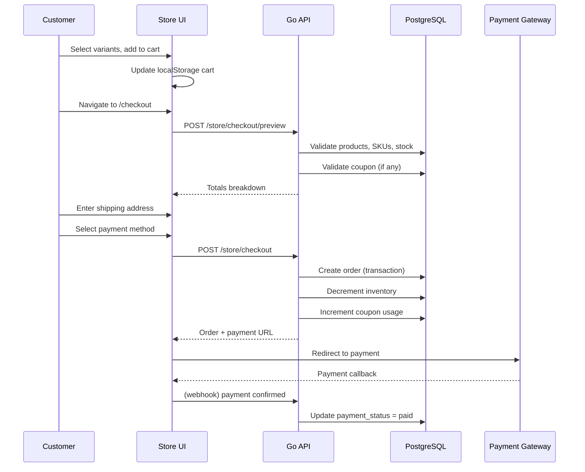

# Workflow: Customer Checkout

## Overview

End-to-end flow from product selection to order placement on the customer store.

## Steps

### Step 1 — Cart Review

**UI:** `/checkout` (step 1)

**Actions:**
- Display cart line items with variant labels (size, color, weight)
- Allow quantity adjustment
- Show subtotal in Toman

**API:** None (client-side cart in localStorage for v1)

**Business rules:**
- Minimum quantity: 1
- Maximum quantity: available stock
- Remove item if product becomes unavailable

---

### Step 2 — Shipping & Customer Info

**UI:** `/checkout` (step 2)

**Fields:**
- First name, last name (required)
- Email (required)
- Phone (required, Iranian format)
- Shipping address: street, city, postal code
- Order notes (optional)
- Coupon code (optional)

**API:** `POST /store/checkout/preview`

**Validation:**
- Email format
- Phone: `09xxxxxxxxx` or `+98...`
- Postal code: 10 digits
- Coupon validated server-side

---

### Step 3 — Payment

**UI:** `/checkout` (step 3)

**Payment methods (from store FAQ):**
- Online gateway (primary)
- Card-to-card (manual verification)
- Cash on delivery (Tehran/Karaj only — assumption)

**API:** `POST /store/checkout`

**On success:**
- Create order with `status: pending`, `payment_status: unpaid`
- Return `payment_url` for online payments
- Clear cart from localStorage
- Redirect to order confirmation or payment gateway

---

## Edge Cases

| Scenario | Handling |
|----------|----------|
| Stock changed between preview and submit | Return `UNPROCESSABLE` with affected items |
| Coupon exhausted during checkout | Reject with message |
| Guest checkout | Create guest customer record |
| Authenticated customer | Link to existing customer, pre-fill address |
| Payment timeout | Order remains `unpaid`; admin can cancel after 24h |
| Duplicate submit | Idempotency key prevents double orders |

## Post-Order

1. Admin sees order in `/orders` with `pending` status
2. Admin processes → `processing` → `shipped` → `delivered`
3. Customer sees status in `/account` order history
4. Confirmation email sent (when email service wired)

## Dependencies

- Product catalog with SKU resolution
- Coupon validation service
- Order creation service (exists for admin, extend for storefront)
- Payment gateway integration (Milestone 7)
- Customer entity (guest + registered)
