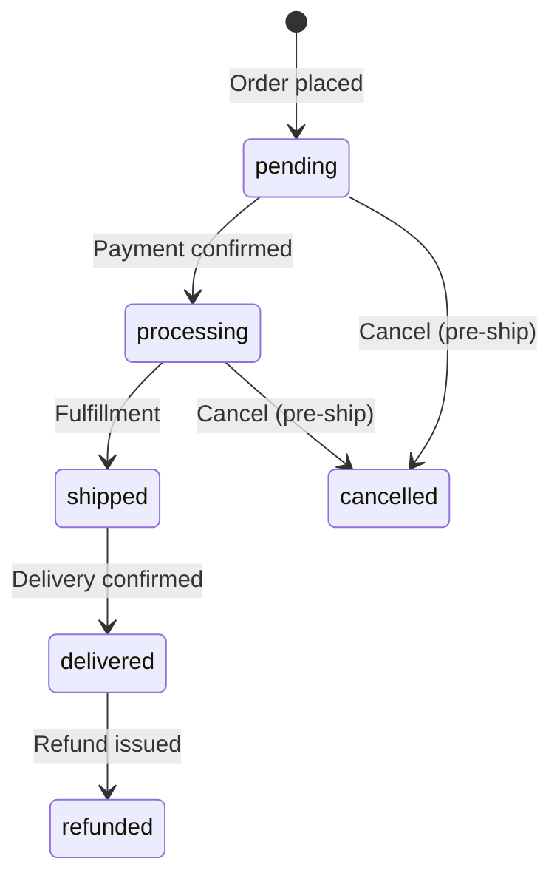

# Workflow: Admin Order Management

## Overview



## User Flow

### List Orders (`/orders`)

1. Admin opens orders page
2. System loads paginated order list
3. Admin can filter by:
   - Status (pending, processing, shipped, delivered, cancelled, refunded)
   - Payment status (unpaid, paid, refunded)
   - Date range (today, this week, this month, custom)
   - Search (order number, customer name/email)
4. Admin clicks row → order detail

**API:** `GET /admin/orders?status=&payment_status=&from=&to=&q=&page=&per_page=`

---

### Order Detail (`/orders/:id`)

1. Display order summary: number, status, payment status, totals
2. Display customer info with link to `/users/:id`
3. Display line items with product names, SKUs, quantities, prices
4. Display billing and shipping addresses
5. Display payment method and transaction ID
6. Display status timeline
7. Actions available based on current status

**API:** `GET /admin/orders/{id}`

---

### Status Update

1. Admin selects new status from dropdown
2. Optionally adds note
3. System validates state transition
4. Timeline entry created

**API:** `PATCH /admin/orders/{id}/status`

```json
{ "status": "shipped", "note": "Shipped via post" }
```

**Valid transitions:**

| From | To |
|------|-----|
| pending | processing, cancelled |
| processing | shipped, cancelled |
| shipped | delivered |
| delivered | refunded (if paid) |

---

### Cancel Order

Available when status is `pending` or `processing`.

**API:** `POST /admin/orders/{id}/cancel`

**Side effects:**
- Status → `cancelled`
- Restore inventory (recommended)
- Timeline entry

---

### Refund Order

Available when status is `delivered` and `payment_status` is `paid`.

**API:** `POST /admin/orders/{id}/refund`

```json
{ "amount": 199.99, "reason": "Customer request" }
```

**Side effects:**
- Status → `refunded`
- Payment status → `refunded`
- Timeline entry

---

### Internal Notes

Admin can save notes without changing status.

**API:** `PATCH /admin/orders/{id}/notes`

```json
{ "notes": "Customer called about delivery delay" }
```

---

### Print Invoice (`/orders/:id/invoice`)

1. Admin clicks "Print Invoice"
2. System fetches invoice data
3. Browser print dialog opens with formatted layout

**API:** `GET /admin/orders/{id}/invoice`

---

### Manual Order Creation (`/orders/create`)

1. Admin searches/selects customer (or creates inline)
2. Admin adds products with quantities
3. Admin sets addresses, payment method
4. Optional coupon code
5. Submit creates order

**API:** `POST /admin/orders`

## Edge Cases

| Scenario | Handling |
|----------|----------|
| Cancel after shipped | Rejected — must use refund flow |
| Partial refund | Support `amount` < total in refund request |
| Guest customer order | Customer snapshot stored on order |
| Concurrent status update | Optimistic locking or version check |

## Permissions

- Requires `admin` role
- All actions logged (audit log — future)
