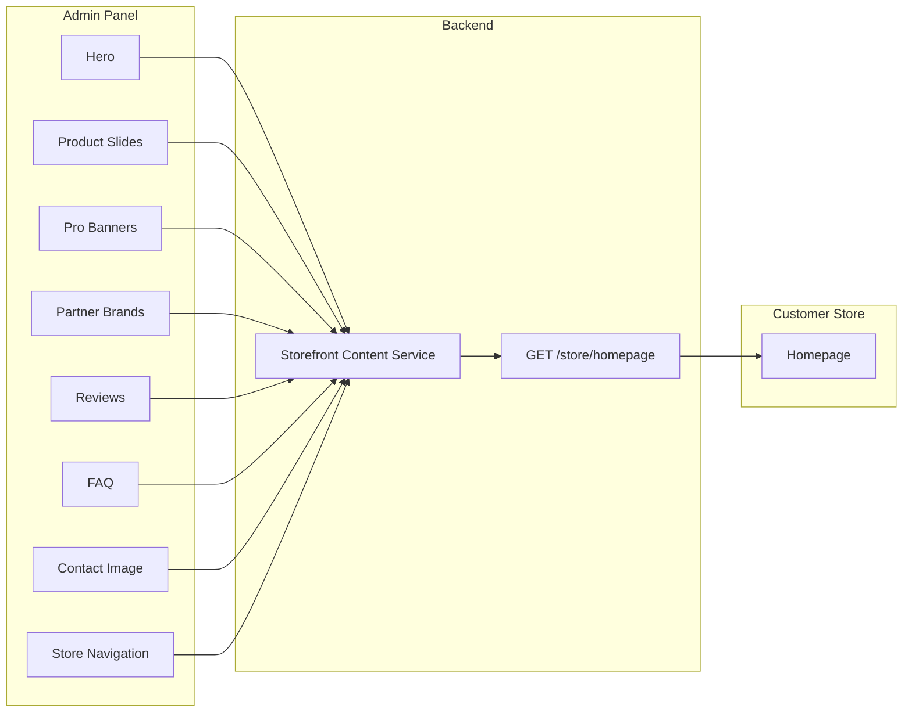

# Workflow: Storefront Content Management

## Overview

Admin configures homepage sections via `/context/*` routes. Store renders via aggregated `GET /store/homepage`.

## Sections

### 1. Hero (`/context/hero`)

**Admin actions:**
1. Upload hero video (MP4, max 50MB)
2. Set title, subtitle
3. Configure primary CTA (text + URL)
4. Configure secondary CTA (text + URL)
5. Save

**Store rendering:** Full-width video background with overlay text and buttons.

**API:** `GET/PUT /admin/storefront/hero`

---

### 2. Product Slides (`/context/product-slides`)

Three independent carousels:

| Slide Type | UI Behavior | Admin Config |
|------------|-------------|--------------|
| Featured (Slide 1) | Tabbed carousel (bestseller/new/discounted tabs) | Products per tab + tab labels |
| Bestseller (Slide 2) | Single carousel | Product picker |
| Discounted (Slide 3) | Single carousel | Product picker |

**Admin actions:**
1. Set autoplay interval (ms, default 4500)
2. Add/remove products per slide
3. Reorder products via drag-and-drop
4. For featured: assign tab labels

**Store rendering:** Product cards with image, name, variant count, price, discount badge, wishlist button.

**API:** `GET/PUT /admin/storefront/product-slides`

---

### 3. Pro Banners (`/context/pro-banners`)

**Admin actions:**
1. Add banner with desktop image (required)
2. Upload mobile image (optional, falls back to desktop)
3. Set click-through link URL
4. Reorder banners
5. Toggle active/inactive

**Store rendering:** Responsive banner carousel between homepage sections.

**API:** `GET/PUT /admin/storefront/pro-banners`

---

### 4. Partner Brands (`/context/brands`)

**Admin actions:**
1. Add brand with title, description, logo
2. Optional link URL
3. Reorder

**Store rendering:** Logo grid with "برندهایی که با آن‌ها کار می‌کنیم" section.

**API:** CRUD `/admin/storefront/partner-brands`

---

### 5. Customer Reviews (`/context/customer-reviews`)

**Admin actions:**
1. Add review with customer name, photo, text, optional rating
2. Reorder for carousel display

**Store rendering:** Testimonial carousel with quotes.

**Note:** Distinct from product-level reviews (`product_reviews` table).

**API:** CRUD `/admin/storefront/homepage-reviews`

---

### 6. FAQ (`/context/faq`)

**Admin actions:**
1. Upload FAQ section image(s)
2. Add/edit Q&A items independently
3. Reorder items

**Store rendering:** Accordion FAQ + optional images.

**API:** `GET/PUT /admin/storefront/faq`

---

### 7. Contact Us Section (`/context/contact-us`)

**Admin actions:**
1. Upload contact section image

**Store rendering:** Image alongside contact form on homepage/about.

**API:** `GET/PUT /admin/storefront/contact-section`

---

### 8. Store Navigation (`/context/navigation`)

**Admin actions:**
1. Manage storefront header/footer menu items
2. Nested children supported
3. Set label, URL, sort order, active flag

**Store rendering:** Header nav, mobile menu, footer links.

**API:** `GET/PUT /admin/storefront/navigation`

**Open question:** Merge with existing `/navigation` settings or keep separate?

## Publish Flow

**Assumption (A1):** Changes are live immediately on save (no draft/publish toggle for v1).

**Cache invalidation:** On any section save, invalidate `homepage` cache tag.

## Edge Cases

| Scenario | Handling |
|----------|----------|
| Referenced product deleted | Remove from slide on next save; filter in API response |
| Referenced product archived | Hide from carousel |
| Video upload fails | Show error, keep previous video |
| Empty slide | Hide section on storefront |
| No purchased theme | Use default free theme |

## Dependencies

- File upload service (exists)
- Product list API for product picker
- Homepage aggregation endpoint (new)
